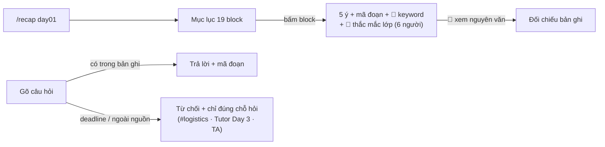

# Demo flow — `/recap` trên buổi Day 1

> **Nộp CP2.** File giao diện: [`recap-demo.html`](recap-demo.html) — mở trực tiếp
> bằng browser (double-click, không cần server, không cần key). Ảnh chụp màn hình
> lấy từ chính file này. Demo là **kịch bản tĩnh trên buổi Day 1**; bản chạy thật
> nằm ở `codebase/agent/` (gpt-4o-mini + 6 tool, test suite ở `codebase/tests/`).

## Sản phẩm một câu

Học viên vừa học xong gõ `/recap` trong Discord → bot dựng lại buổi học thành các
**block có trích dẫn** `[T04-NNN]` về đúng lời giảng viên, kèm mục **"Bạn học từng
vướng gì ở đây"** gom từ thắc mắc thật của lớp; hỏi thêm thì bot chỉ trả lời khi
**có căn cứ trong buổi**, còn lại từ chối và chỉ đúng chỗ cần hỏi.

## Flow chính — bấm gì, gõ gì, ra gì

| # | Người dùng làm gì | Hệ thống trả gì |
|---|---|---|
| 1 | Gõ **`/recap day01`** | Header 3 dòng nói rõ bot làm được gì (dựng từ 98 đoạn bản ghi + 82 slide) + **mục lục 19 block** bấm được; khai báo đã bỏ 2 mục chào lớp/bên lề |
| 2 | **Bấm block** ⭐ *Attention, multi-head…* | 1 message: **5 ý chính, mỗi ý kèm mã đoạn** `[T04-053..057]` + badge `✅ 5/5 ý có mã đoạn` + dòng `🔑 Keyword` + mục thu gọn 💬 *Bạn học từng vướng gì ở đây (6 người)* — cụm thắc mắc thật từ chatlog VLearn (câu đại diện `[M0382]`) |
| 3 | Bấm **📖 Xem nguyên văn [T04-053]** | Nguyên văn đoạn bản ghi hiện ngay dưới — học viên tự đối chiếu bot có bịa không trong 5 giây |
| 4 | Gõ câu hỏi: *"Hai mùa đông AI là gì?"* | Bot tìm trong bản ghi rồi trả lời ngắn **kèm mã đoạn** `[T04-022][T04-023]` + nút xem nguyên văn |
| 5 | Bấm **⚠️ Sai chỗ nào?** | Chọn *sai block / thiếu ý / trích dẫn sai đoạn* → ghi vào feedback log (`validation/`) |

## Hai đường từ chối (case chỗ khó — phần nhóm muốn giám khảo bấm thử)

| Người dùng hỏi | Bot trả |
|---|---|
| *"Deadline nộp lab?"* | **Từ chối, không đoán** — bot chỉ đọc bản ghi bài giảng, trả lời sai deadline là học viên trượt bài nộp thật → chỉ sang `#logistics` / TA |
| *"Giải thích ReAct đi"* | Bot search 98 đoạn → **0 kết quả** → nói thẳng *ReAct không có trong buổi Day 1, nó thuộc buổi Day 3*, và **không tự giảng từ kiến thức ngoài** → chỉ sang VLearn Tutor/TA |

## Vì sao tin được (điểm khác biệt)

- **Mọi ý đều trace được**: không có mã đoạn ⇒ bot không được viết ý đó (luật cứng
  trong system prompt + chấm ở golden set `eval/`).
- **Thắc mắc lớp là thật**: gom từ 1.261 câu hỏi VLearn đã ẩn danh, chỉ hiện *số
  người*, không bao giờ hiện danh tính.
- **Biết-mình-không-biết**: hai đường từ chối ở trên chạy được ngay trong demo.
